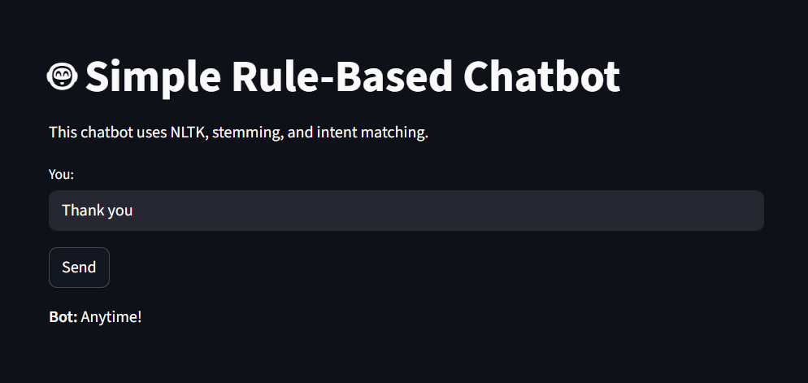

# 🤖 Simple Rule-Based Chatbot

This is a beginner-friendly rule-based chatbot built using **Python**, **NLTK**, and **Streamlit**.

## 🔹 Features
- Intent detection using keyword matching
- Text preprocessing using tokenization and stemming
- Randomized chatbot responses
- Interactive web interface using Streamlit

## 🔹 Tech Stack
- Python
- NLTK
- Streamlit

## 🔹 How to Run Locally
1. Clone the repository
2. Create and activate a virtual environment
3. Install dependencies:
   ```bash
   pip install -r requirements.txt
   
## 📸 Screenshot



